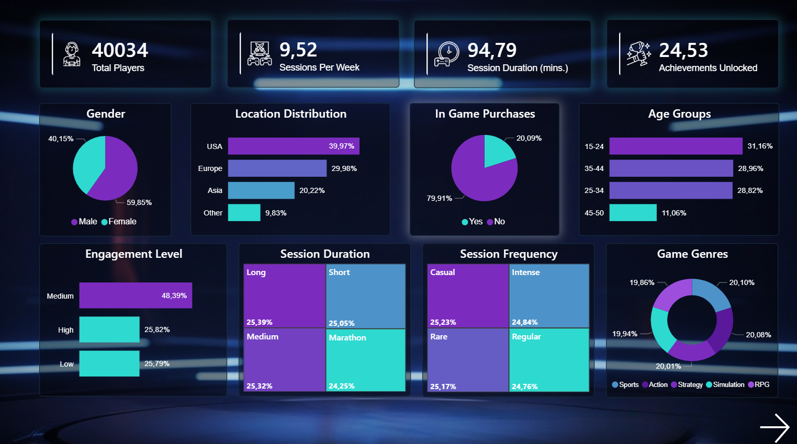
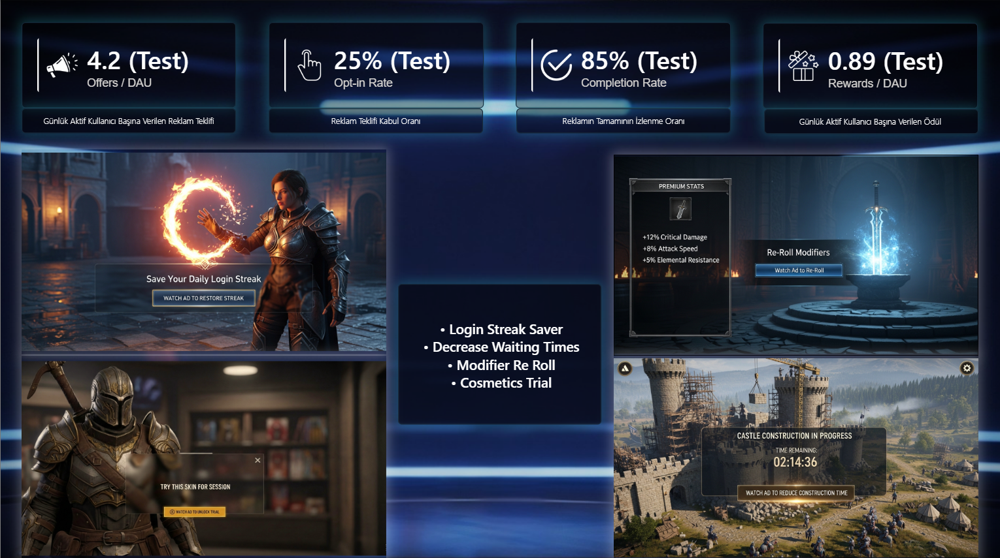
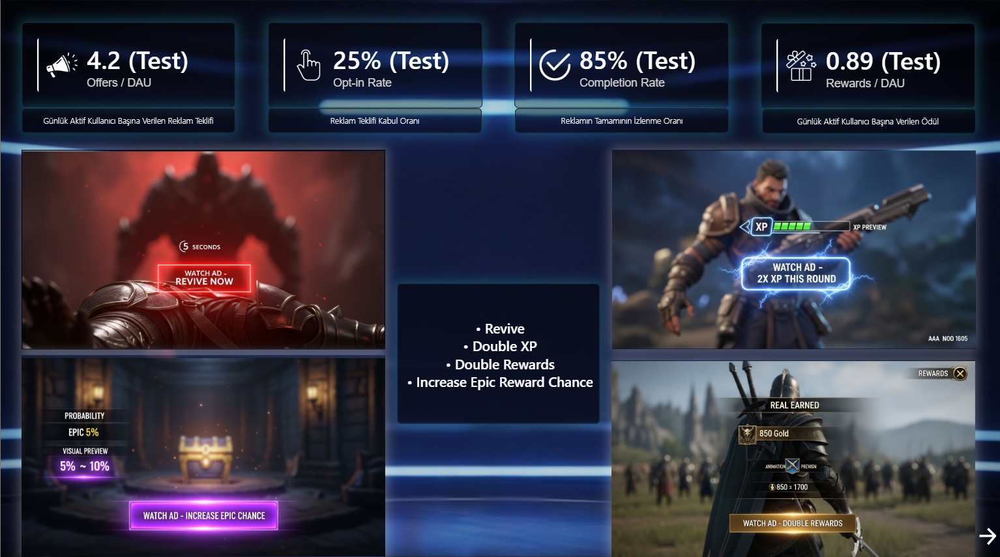
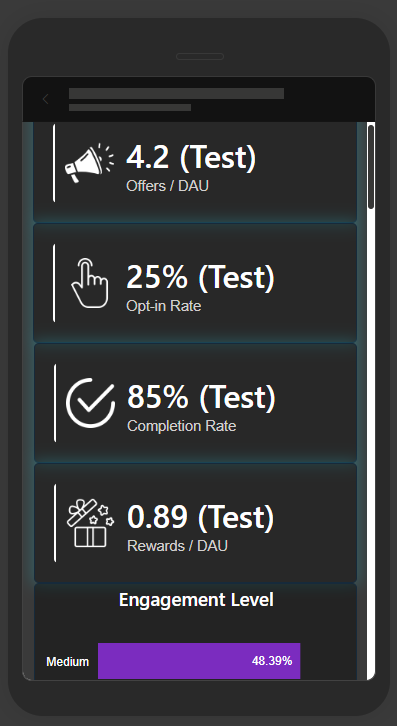

# LootMetrics-# LootMetrics | Player Behaviour & Monetisation Analysis

## Overview

LootMetrics is an end-to-end player behaviour analytics project. The goal was to segment players based on behavioural patterns — session frequency, session duration, and achievement output — and develop cluster-specific engagement strategies. A key finding revealed that only **20% of players made in-game purchases**, pointing to a structurally weak monetisation model.

---

## Problem Statement

The game's monetisation relied heavily on direct in-game purchases, yet the vast majority of the player base was not converting. The project aimed to:
- Understand how different player types behave
- Identify the key drivers of engagement per segment
- Propose actionable monetisation alternatives suited to each segment

---

## Dataset

- **Source:** Game behavioural dataset (`game_data.xlsx`)
- **Features include:** Age, Gender, Location, GameGenre, GameDifficulty, InGamePurchases, SessionsPerWeek, AvgSessionDurationMinutes, AchievementsUnlocked, PlayerLevel, EngagementLevel

---

## Methodology

### 1. Exploratory Data Analysis (EDA)
- Univariate and bivariate analysis across all features
- Outlier detection using IQR method
- Distribution analysis for numerical and categorical variables
- Feature engineering: `MinutesPerLevel`, `MinutesPerAchievement`

### 2. Clustering — K-Means Segmentation
- Feature selection: `SessionsPerWeek`, `AvgSessionDurationMinutes`, `AchievementsUnlocked`
- Scaling with `StandardScaler` and `RobustScaler`
- Optimal k determined via Elbow Method + Silhouette Score analysis
- **Final model: k=6 clusters**
- Cluster profiling using mean, median, and coefficient of variation
- PCA-based 2D visualisation for cluster separation

### 3. Cluster-Specific Engagement Modelling
For each of the 6 clusters, a supervised classification model was trained to predict `EngagementLevel` (Low / Medium / High):

| Cluster | Best Model | Notes |
|---------|-----------|-------|
| C1 | Random Forest / CatBoost | Compared both |
| C2 | Random Forest / CatBoost | Compared both |
| C3 | Random Forest / CatBoost | Compared both |
| C4 | Random Forest / CatBoost | Compared both |
| C5 | Random Forest / CatBoost | Compared both |

- Train/test split: 80/20 with stratification
- Evaluation metrics: Accuracy, Precision, Recall (weighted), F1, Confusion Matrix
- Feature importance analysis per cluster to identify key engagement drivers

---

## Key Findings

- **Only 20% of players made in-game purchases** — indicating a weak monetisation structure
- In-game purchase behaviour appeared largely independent of engagement level and game difficulty
- Player engagement drivers varied significantly across clusters — a one-size-fits-all strategy would be ineffective
- Session frequency and achievement rate were the strongest predictors of engagement in most clusters

---

## Business Recommendation

Given the low purchase conversion rate, a **value-based advertising revenue model** was proposed as a monetisation alternative — targeting non-paying but engaged players through reward-based ads tailored to each cluster's behaviour profile.

---

## Deliverables

| File | Description |
|------|-------------|
| `GamingBehaviour_EDA.ipynb` | Full EDA, clustering, and ML modelling notebook |
| `LootMetrics_Final.pbix` | Power BI dashboard — desktop version |
| `LootMetrics_Mobile.pbix` | Power BI dashboard — mobile layout |

---

## Tools & Libraries

- **Python:** pandas, numpy, matplotlib, seaborn, plotly
- **Machine Learning:** scikit-learn (KMeans, RandomForestClassifier), CatBoost
- **Clustering validation:** yellowbrick (KElbowVisualizer, SilhouetteVisualizer)
- **Dimensionality reduction:** PCA
- **Visualisation & Reporting:** Power BI

---

## How to Run

1. Clone the repository
2. Install dependencies:
   ```bash
   pip install pandas numpy matplotlib seaborn plotly scikit-learn catboost yellowbrick
   ```
3. Place `game_data.xlsx` in the project directory
4. Run `GamingBehaviour_EDA.ipynb` in Jupyter Notebook or JupyterLab
5. Open `.pbix` files in Power BI Desktop to explore the dashboards


## Dashboard Preview










